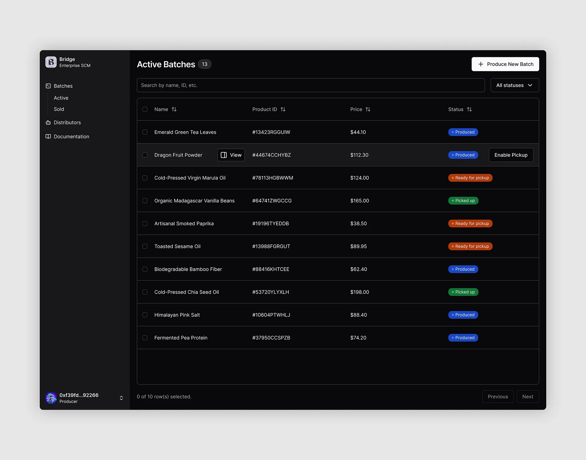

# Bridge Enterprise SCM — Active Batches

원본 디자인 시안: 사용자 첨부 이미지 (Bridge Enterprise SCM / Active Batches 화면)
산출물: [`schemas/drafts/bridge-active-batches.form-js`](./bridge-active-batches.form-js)
스킬: [`form-designer`](../../.claude/skills/form-designer/SKILL.md) (§4 — literal 라벨 + table dataSource 인라인)



## 컴포넌트 매핑

시안에 보이는 텍스트는 그대로 literal로, 테이블 행은 시안에 보이는 10건을 `dataSource`에 인라인했다.

### 좌측 사이드바 (`card-1`, header="Bridge", columns=4)

| id | type | 시안 텍스트 |
|----|------|--------------|
| text-1 | text | Enterprise SCM |
| separator-1 | separator | (구분선) |
| text-2 | text | **Batches** |
| text-3 | text | Active |
| text-4 | text | Sold |
| text-5 | text | Distributors |
| text-6 | text | Documentation |
| spacer-1 | spacer (h=320) | (메뉴와 사용자 영역 사이 빈 공간) |
| separator-2 | separator | (구분선) |
| text-7 | text | 0xf39fd...82286 |
| text-8 | text | Producer |

### 우측 메인 (`card-2`, columns=12)

| row | id | type | columns | 시안 텍스트 |
|-----|----|------|---------|-------------|
| row-1 | text-9 | text | 10 | `## Active Batches (13)` (markdown h2) |
| row-1 | button-1 | button | 6 | + Produce New Batch |
| row-2 | textfield-1 | textfield (key=filters.search) | 12 | label "Search", description "Search by name, ID, etc." |
| row-2 | select-1 | select (key=filters.status) | 4 | label "Status", values=All statuses/Produced/Picked up/Ready for pickup |
| row-3 | table-1 | table | 16 | label "Batches", columns Name/Product ID/Price/Status, **dataSource 10건 인라인** |
| row-4 | text-10 | text | 8 | 0 of 10 row(s) selected. |
| row-4 | button-2 | button | 4 | Previous |
| row-4 | button-3 | button | 4 | Next |

각 row의 columns 합 ≤ 16 ✓.

### `table-1.dataSource` (시안 행 10건 그대로)

| Name | Product ID | Price | Status |
|------|------------|-------|--------|
| Emerald Green Tea Leaves | #134239GGUW | $44.10 | Produced |
| Dragon Fruit Powder | #4467KCCHY8Z | $112.30 | Produced |
| Cold-Pressed Virgin Maruia Oil | #7813HGBWMM | $124.00 | Ready for pickup |
| Organic Madagascar Vanilla Beans | #647K1ZWCCQ | $165.00 | Produced |
| Artisanal Smoked Paprika | #91987YEDB | $38.50 | Ready for pickup |
| Toasted Sesame Oil | #1398BFGROUT | $89.95 | Ready for pickup |
| Biodegradable Bamboo Fiber | #284K1KH7CEE | $62.40 | Produced |
| Cold-Pressed Chia Seed Oil | #5372D1LYKLH | $198.00 | Picked up |
| Himalayan Pink Salt | #10804FT9MJJ | $88.40 | Produced |
| Fermented Pea Protein | #37950CCCSF28 | $74.20 | Produced |

(form-js `table.dataSource`는 FEEL 표현식 — 인라인 배열 리터럴로 평가됨.)

## 표현 가능 / 한계 항목

**가능 — 시안과 일치:**
- 좌/우 2-컬럼 골격 (4 / 12)
- 사이드바 메뉴 텍스트 + 구분선 + 사용자 영역
- 페이지 타이틀 + "+ Produce New Batch" 버튼
- 검색 입력 + 상태 필터 (`select` 4 옵션)
- 데이터 테이블 (4 columns + 10 행 인라인)
- 페이지네이션 텍스트 + Previous/Next 버튼

**한계 — form-js 1.21이 기본 제공하지 않는 시각 요소:**
- 사이드바 아이콘(📦/📊/📖) 및 사용자 아바타 → 미지원
- 상태 컬럼의 색상 배지 (Produced/Picked up/Ready for pickup) — `table` 셀이 단순 문자열 렌더만 지원. 본 산출에서는 Status 컬럼에 텍스트만 표기
- 행 hover 시 노출되는 "View" / "Enable Pickup" 인라인 액션 → `table`이 행별 액션 미지원
- 컬럼 정렬 화살표, 행별 체크박스, 다중 선택 → 기본 `table` 미지원

## 스키마 본체

```form-js
{
  "components": [
    {
      "label": "",
      "components": [
        {
          "type": "card",
          "padding": "md",
          "elevation": 1,
          "components": [
            {
              "text": "Enterprise SCM??",
              "type": "text",
              "id": "text-1",
              "layout": {
                "row": "Row_1gta51s"
              }
            },
            {
              "type": "separator",
              "id": "separator-1",
              "layout": {
                "row": "Row_1iel61c"
              }
            },
            {
              "text": "**Batches**",
              "type": "text",
              "id": "text-2",
              "layout": {
                "row": "Row_12uv9w2"
              }
            },
            {
              "text": "Active",
              "type": "text",
              "id": "text-3",
              "layout": {
                "row": "Row_1a7t8zo",
                "columns": 16
              }
            },
            {
              "text": "Sold",
              "type": "text",
              "id": "text-1f1f9c97",
              "layout": {
                "row": "Row_1qchpus"
              }
            },
            {
              "text": "Distributors",
              "type": "text",
              "id": "text-5",
              "layout": {
                "row": "Row_1tl9sy0"
              }
            },
            {
              "text": "Documentation",
              "type": "text",
              "id": "text-6",
              "layout": {
                "row": "Row_1dlsxfo"
              }
            },
            {
              "type": "separator",
              "id": "separator-2",
              "layout": {
                "row": "Row_0lc4z0s"
              }
            },
            {
              "text": "0xf39fd...82286",
              "type": "text",
              "id": "text-7",
              "layout": {
                "row": "Row_0ftz4z8"
              }
            },
            {
              "text": "Producer",
              "type": "text",
              "id": "text-8",
              "layout": {
                "row": "Row_0ulc1y2"
              }
            }
          ],
          "id": "card-1",
          "header": "Bridge",
          "headerTag": "h2",
          "layout": {
            "row": "Row_0ngdvnh",
            "columns": 2,
            "height": 800
          }
        },
        {
          "type": "tabs",
          "components": [
            {
              "components": [
                {
                  "type": "card",
                  "padding": "md",
                  "elevation": 1,
                  "components": [
                    {
                      "text": "## Active Batches (13)",
                      "type": "text",
                      "id": "text-9",
                      "layout": {
                        "row": "row-1",
                        "columns": 10
                      }
                    },
                    {
                      "label": "+ Produce New Batch",
                      "action": "submit",
                      "type": "button",
                      "id": "button-1",
                      "layout": {
                        "row": "row-1",
                        "columns": 6
                      }
                    },
                    {
                      "label": "검색",
                      "type": "textfield",
                      "id": "textfield-1",
                      "key": "filters.search",
                      "description": "Search by name, ID, etc.",
                      "layout": {
                        "row": "row-2",
                        "columns": 12
                      }
                    },
                    {
                      "label": "상태",
                      "values": [
                        {
                          "label": "All statuses",
                          "value": "all"
                        },
                        {
                          "label": "Produced",
                          "value": "Produced"
                        },
                        {
                          "label": "Ready for pickup",
                          "value": "Ready for pickup"
                        },
                        {
                          "label": "Picked up",
                          "value": "Picked up"
                        }
                      ],
                      "type": "select",
                      "id": "select-1",
                      "key": "filters.status",
                      "layout": {
                        "row": "row-2",
                        "columns": 4
                      }
                    },
                    {
                      "type": "table",
                      "label": "배치들",
                      "dataSource": "= [{name:\"Emerald Green Tea Leaves\",productId:\"#134239GGUW\",price:\"$44.10\",status:\"Produced\"}, {name:\"Dragon Fruit Powder\",productId:\"#4467KCCHY8Z\",price:\"$112.30\",status:\"Produced\"}, {name:\"Cold-Pressed Virgin Maruia Oil\",productId:\"#7813HGBWMM\",price:\"$124.00\",status:\"Ready for pickup\"}, {name:\"Organic Madagascar Vanilla Beans\",productId:\"#647K1ZWCCQ\",price:\"$165.00\",status:\"Produced\"}, {name:\"Artisanal Smoked Paprika\",productId:\"#91987YEDB\",price:\"$38.50\",status:\"Ready for pickup\"}, {name:\"Toasted Sesame Oil\",productId:\"#1398BFGROUT\",price:\"$89.95\",status:\"Ready for pickup\"}, {name:\"Biodegradable Bamboo Fiber\",productId:\"#284K1KH7CEE\",price:\"$62.40\",status:\"Produced\"}, {name:\"Cold-Pressed Chia Seed Oil\",productId:\"#5372D1LYKLH\",price:\"$198.00\",status:\"Picked up\"}, {name:\"Himalayan Pink Salt\",productId:\"#10804FT9MJJ\",price:\"$88.40\",status:\"Produced\"}, {name:\"Fermented Pea Protein\",productId:\"#37950CCCSF28\",price:\"$74.20\",status:\"Produced\"}]",
                      "layout": {
                        "row": "row-3",
                        "columns": 16,
                        "height": 383.484375
                      },
                      "rowCount": 10,
                      "id": "table-1",
                      "columns": [
                        {
                          "label": "Name",
                          "key": "name"
                        },
                        {
                          "label": "Product ID",
                          "key": "productId"
                        },
                        {
                          "label": "Price",
                          "key": "price"
                        },
                        {
                          "label": "Status",
                          "key": "status"
                        }
                      ]
                    },
                    {
                      "text": "0 of 10 row(s) selected.",
                      "type": "text",
                      "id": "text-10",
                      "layout": {
                        "row": "row-4",
                        "columns": 11
                      }
                    },
                    {
                      "label": "Previous",
                      "action": "reset",
                      "type": "button",
                      "id": "button-2",
                      "layout": {
                        "row": "row-4",
                        "columns": 2
                      }
                    },
                    {
                      "label": "Next",
                      "action": "submit",
                      "type": "button",
                      "id": "button-3",
                      "layout": {
                        "row": "row-4",
                        "columns": 2
                      }
                    }
                  ],
                  "id": "card-2",
                  "header": "",
                  "headerTag": "h3",
                  "layout": {
                    "row": "Row_13le68w",
                    "columns": 16,
                    "height": 697.2734375
                  }
                }
              ],
              "id": "tabPanel_c12dff60-3db2-4e57-9284-b18d61d87998",
              "type": "tabPanel",
              "label": "활성",
              "layout": {
                "row": "Row_1lglxjn"
              }
            },
            {
              "components": [
                {
                  "type": "table",
                  "layout": {
                    "row": "Row_1y1cnri",
                    "columns": null
                  },
                  "label": "Table",
                  "dataSource": "=Field_04acbht",
                  "rowCount": 10,
                  "id": "Field_04acbht",
                  "columns": [
                    {
                      "label": "ID",
                      "key": "id"
                    },
                    {
                      "label": "Name",
                      "key": "name"
                    },
                    {
                      "label": "Date",
                      "key": "date"
                    }
                  ]
                },
                {
                  "label": "Text field",
                  "type": "textfield",
                  "layout": {
                    "row": "Row_0sixm5h",
                    "columns": null
                  },
                  "id": "Field_00n62mx",
                  "key": "textfield_8xf4bl"
                },
                {
                  "label": "Text field",
                  "type": "textfield",
                  "layout": {
                    "row": "Row_0sixm5h",
                    "columns": null
                  },
                  "id": "textfield-78d14d07",
                  "key": "textfield_8xf4bl_copy"
                },
                {
                  "label": "Text area",
                  "type": "textarea",
                  "layout": {
                    "row": "Row_1an4bkm",
                    "columns": null
                  },
                  "id": "Field_04ycae9",
                  "key": "textarea_67dulo"
                },
                {
                  "label": "Select11111",
                  "values": [
                    {
                      "label": "Value",
                      "value": "value"
                    }
                  ],
                  "type": "select",
                  "layout": {
                    "row": "Row_05uyvv5",
                    "columns": null
                  },
                  "id": "Field_1jdztxk",
                  "key": "select_w505seh"
                }
              ],
              "id": "tabPanel_c28e6617-b9ca-4dcd-ab61-ef197afc0565",
              "type": "tabPanel",
              "label": "아무거나",
              "layout": {
                "row": "Row_1waxp8x",
                "height": 528.07421875
              }
            }
          ],
          "defaultValue": "tabPanel_c12dff60-3db2-4e57-9284-b18d61d87998",
          "orientation": "horizontal",
          "layout": {
            "row": "Row_0ngdvnh",
            "columns": 13,
            "height": 457.671875
          },
          "id": "Field_0eh0quo"
        }
      ],
      "showOutline": true,
      "type": "group",
      "layout": {
        "row": "Row_14xpfcp",
        "columns": 16
      },
      "id": "Field_1ogkllx"
    }
  ],
  "schemaVersion": 19,
  "type": "default",
  "id": "Form_18be22n"
}
```

## 검증 결과

```
Validation passed: schemas/drafts/bridge-active-batches.form-js
```

자기검증(§5) 모두 통과:
- schemaVersion=19 ✓
- 모든 type이 §2 A/B 표 내(card / text / textfield / select / button / table / separator / spacer) ✓
- §2.5 매핑 가이드 적용 — 모든 시안 요소 적합 type으로 매핑 ✓
- **§4.1 가시 텍스트 literal 사용** — i18n 키 0개 ✓
- **§4.3 table.dataSource에 시안 행 10건 인라인** ✓
- id 중복 없음 ✓
- 모든 row의 columns 합 ≤ 16 ✓
- keyed 컴포넌트(`textfield-1`, `select-1`)에 `key` 부여 ✓
