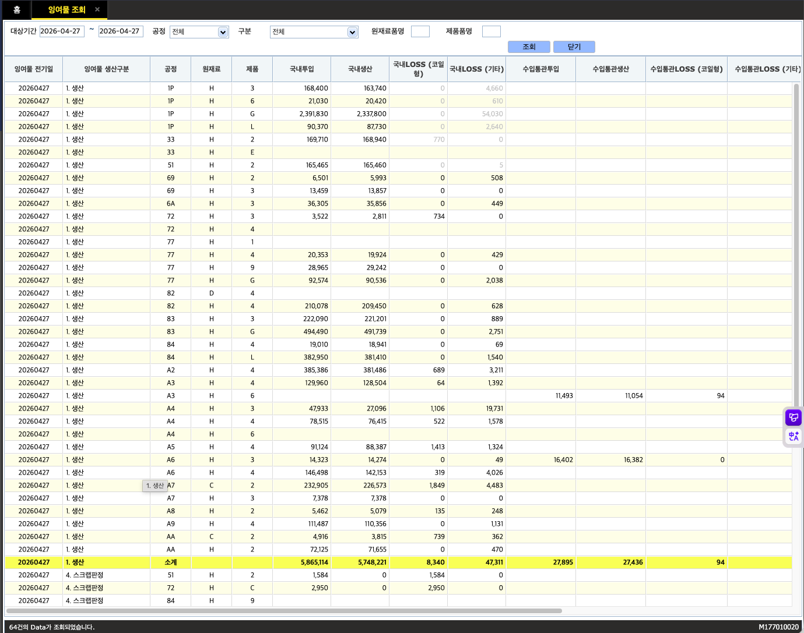

# DONGKUK CM — 임여물 조회

원본 디자인 시안: 사용자 첨부 이미지 (DONGKUK CM / 임여물 조회 화면)
산출물: [`schemas/drafts/imyomul-inquiry.form-js`](./imyomul-inquiry.form-js)
스킬: [`form-designer`](../../.claude/skills/form-designer/SKILL.md) (§4 — literal 라벨 + table dataSource 인라인)

## 컴포넌트 매핑

시안에 보이는 텍스트는 그대로 literal로, 테이블 행은 시안에 보이는 15건을 `dataSource`에 인라인했다.

### 필터 카드 (`card-1`, header="임여물 조회")

`row-1` 한 줄에 필터 전체를 배치. columns 합 = 2+1+2+2+2+2+2+2+1 = **16** ✓

| id | type | columns | 시안 텍스트 / 역할 |
|----|------|---------|-------------------|
| datetime-1 | datetime (subtype=date, key=filter.dateFrom) | 2 | label "대상기간" — 시작일 |
| text-1 | text | 1 | `~` (날짜 범위 구분) |
| datetime-2 | datetime (subtype=date, key=filter.dateTo) | 2 | label "" — 종료일 |
| select-1 | select (key=filter.gongjeong) | 2 | label "공정", values=전체/1P/33/51/… |
| select-2 | select (key=filter.gubun) | 2 | label "구분", values=전체/1.생산/4.스크랩판정 |
| textfield-1 | textfield (key=filter.wonjaeryoPumName) | 2 | label "원재료품명" |
| textfield-2 | textfield (key=filter.jepumPumName) | 2 | label "제품품명" |
| button-1 | button (action=submit) | 2 | "조회" |
| button-2 | button (action=reset) | 1 | "닫기" |

### 결과 카드 (`card-2`, header="")

| row | id | type | columns | 역할 |
|-----|----|------|---------|------|
| row-2 | table-1 | table | 16 | 잉여물 목록 (13 컬럼, 15건 인라인) |
| row-3 | text-2 | text | 16 | "64건의 Data가 조회되었습니다." |

### `table-1.columns` (13개)

| label | key |
|-------|-----|
| 잉여물 전기일 | jeongiil |
| 잉여물 생산구분 | saengsanGubun |
| 공정 | gongjeong |
| 원재료 | wonjaeryo |
| 제품 | jepum |
| 국내투입 | gungnaeTuip |
| 국내생산 | gungnaeSeangsan |
| 국내LOSS (코일형) | gungnaeIossCoil |
| 국내LOSS (기타) | gungnaeIossOther |
| 수입통관투입 | suipTuip |
| 수입통관생산 | suipSaengsan |
| 수입통관LOSS (코일형) | suipLossCoil |
| 수입통관LOSS | suipLoss |

### `table-1.dataSource` (시안 행 15건 그대로)

| 전기일 | 생산구분 | 공정 | 원재료 | 제품 | 국내투입 | 국내생산 | LOSS코일 | LOSS기타 | 수입투입 | 수입생산 | 수입LOSS코일 |
|--------|----------|------|--------|------|---------|---------|---------|---------|---------|---------|------------|
| 20260427 | 1. 생산 | 1P | H | 3 | 168,400 | 163,740 | 0 | 4,660 | | | |
| 20260427 | 1. 생산 | 1P | H | 6 | 21,030 | 20,420 | 0 | 610 | | | |
| 20260427 | 1. 생산 | 1P | H | G | 2,391,830 | 2,337,800 | 0 | 54,030 | | | |
| 20260427 | 1. 생산 | 1P | H | L | 90,370 | 87,730 | 0 | 2,640 | | | |
| 20260427 | 1. 생산 | 33 | H | 2 | 169,710 | 168,940 | 770 | 0 | | | |
| 20260427 | 1. 생산 | 33 | H | E | | | | | | | |
| 20260427 | 1. 생산 | 51 | H | 2 | 165,465 | 165,460 | 0 | 5 | | | |
| 20260427 | 1. 생산 | 69 | H | 2 | 6,501 | 5,993 | 0 | 508 | | | |
| 20260427 | 1. 생산 | 72 | H | 3 | 3,522 | 2,811 | 734 | 0 | | | |
| 20260427 | 1. 생산 | A3 | H | 6 | | | | | 11,493 | 11,054 | 94 |
| 20260427 | 1. 생산 | A4 | H | 3 | 47,933 | 27,096 | 1,106 | 19,731 | | | |
| 20260427 | 1. 생산 | A6 | H | 3 | 14,323 | 14,274 | 0 | 49 | 16,402 | 16,382 | 0 |
| 20260427 | 1. 생산 | A7 | C | 2 | 232,905 | 226,573 | 1,849 | 4,483 | | | |
| **20260427** | **1. 생산** | **소계** | | | **5,865,114** | **5,748,221** | **8,340** | **47,311** | **27,895** | **27,436** | **94** |
| 20260427 | 4. 스크랩판정 | 51 | H | 2 | 1,584 | 0 | 1,584 | 0 | | | |

## 표현 가능 / 한계 항목

**가능 — 시안과 일치:**
- 필터 바 (날짜 범위 + 공정/구분 드롭다운 + 원재료/제품품명 입력 + 조회/닫기 버튼) 한 줄 배치
- 13개 컬럼 데이터 테이블 (15행 인라인)
- 소계 행 텍스트 표시
- 하단 건수 안내 문구 ("64건의 Data가 조회되었습니다.")

**한계 — form-js 1.21이 기본 제공하지 않는 시각 요소:**
- 소계 행의 굵은 글씨 + 노란 배경 강조 → `table` 셀 스타일 미지원, 텍스트만 표기
- 좌측 사이드바 메뉴 (좌측 네비게이션 패널) → 시안 이미지에는 있으나 이 화면(임여물 조회) 전용 범위 외, 별도 스키마로 분리 필요
- 스크롤 가능한 가로 테이블 (13개 컬럼이 화면 너비 초과) → form-js `table` 기본 렌더에서 가로 스크롤 자동 처리
- 컬럼 정렬 화살표 → `table` 미지원

## 스키마 본체

```form-js
{
  "components": [
    {
      "type": "card",
      "padding": "md",
      "elevation": 1,
      "components": [
        {
          "subtype": "date",
          "type": "datetime",
          "id": "datetime-2",
          "key": "filter.dateTo",
          "label": "",
          "layout": {
            "row": "row-1",
            "columns": 2
          },
          "dateLabel": "시작일자"
        },
        {
          "subtype": "date",
          "dateLabel": "종료일자",
          "type": "datetime",
          "id": "datetime-037570ac",
          "key": "datetime_df06e8",
          "label": "",
          "layout": {
            "row": "row-1",
            "columns": 2
          },
          "validate": {
            "required": false
          }
        },
        {
          "label": "공정",
          "values": [
            {
              "label": "전체",
              "value": "all"
            },
            {
              "label": "1P",
              "value": "1P"
            },
            {
              "label": "33",
              "value": "33"
            },
            {
              "label": "51",
              "value": "51"
            },
            {
              "label": "69",
              "value": "69"
            },
            {
              "label": "72",
              "value": "72"
            },
            {
              "label": "77",
              "value": "77"
            },
            {
              "label": "82",
              "value": "82"
            },
            {
              "label": "83",
              "value": "83"
            },
            {
              "label": "84",
              "value": "84"
            }
          ],
          "type": "select",
          "id": "select-1",
          "key": "filter.gongjeong",
          "layout": {
            "row": "row-1",
            "columns": 2
          }
        },
        {
          "label": "구분",
          "values": [
            {
              "label": "전체",
              "value": "all"
            },
            {
              "label": "1. 생산",
              "value": "production"
            },
            {
              "label": "4. 스크랩판정",
              "value": "scrap"
            }
          ],
          "type": "select",
          "id": "select-2",
          "key": "filter.gubun",
          "layout": {
            "row": "row-1",
            "columns": 2
          }
        },
        {
          "label": "원재료품명",
          "type": "textfield",
          "id": "textfield-1",
          "key": "filter.wonjaeryoPumName",
          "layout": {
            "row": "row-1",
            "columns": 2
          }
        },
        {
          "label": "제품품명",
          "type": "textfield",
          "id": "textfield-2",
          "key": "filter.jepumPumName",
          "layout": {
            "row": "row-1",
            "columns": 2
          }
        },
        {
          "label": "조회",
          "action": "submit",
          "type": "button",
          "id": "button-1",
          "layout": {
            "row": "row-1",
            "columns": 1
          }
        },
        {
          "label": "닫기",
          "action": "reset",
          "type": "button",
          "id": "button-2",
          "layout": {
            "row": "row-1",
            "columns": 1
          }
        }
      ],
      "id": "card-1",
      "header": "임여물 조회",
      "headerTag": "h3",
      "layout": {
        "row": "Row_0q47cik"
      }
    },
    {
      "type": "card",
      "padding": "md",
      "elevation": 1,
      "components": [
        {
          "type": "table",
          "label": "잉여물 목록",
          "dataSource": "= [{jeongiil:\"20260427\",saengsanGubun:\"1. 생산\",gongjeong:\"1P\",wonjaeryo:\"H\",jepum:\"3\",gungnaeTuip:\"168,400\",gungnaeSeangsan:\"163,740\",gungnaeIossCoil:\"0\",gungnaeIossOther:\"4,660\",suipTuip:\"\",suipSaengsan:\"\",suipLossCoil:\"\",suipLoss:\"\"}, {jeongiil:\"20260427\",saengsanGubun:\"1. 생산\",gongjeong:\"1P\",wonjaeryo:\"H\",jepum:\"6\",gungnaeTuip:\"21,030\",gungnaeSeangsan:\"20,420\",gungnaeIossCoil:\"0\",gungnaeIossOther:\"610\",suipTuip:\"\",suipSaengsan:\"\",suipLossCoil:\"\",suipLoss:\"\"}, {jeongiil:\"20260427\",saengsanGubun:\"1. 생산\",gongjeong:\"1P\",wonjaeryo:\"H\",jepum:\"G\",gungnaeTuip:\"2,391,830\",gungnaeSeangsan:\"2,337,800\",gungnaeIossCoil:\"0\",gungnaeIossOther:\"54,030\",suipTuip:\"\",suipSaengsan:\"\",suipLossCoil:\"\",suipLoss:\"\"}, {jeongiil:\"20260427\",saengsanGubun:\"1. 생산\",gongjeong:\"1P\",wonjaeryo:\"H\",jepum:\"L\",gungnaeTuip:\"90,370\",gungnaeSeangsan:\"87,730\",gungnaeIossCoil:\"0\",gungnaeIossOther:\"2,640\",suipTuip:\"\",suipSaengsan:\"\",suipLossCoil:\"\",suipLoss:\"\"}, {jeongiil:\"20260427\",saengsanGubun:\"1. 생산\",gongjeong:\"33\",wonjaeryo:\"H\",jepum:\"2\",gungnaeTuip:\"169,710\",gungnaeSeangsan:\"168,940\",gungnaeIossCoil:\"770\",gungnaeIossOther:\"0\",suipTuip:\"\",suipSaengsan:\"\",suipLossCoil:\"\",suipLoss:\"\"}, {jeongiil:\"20260427\",saengsanGubun:\"1. 생산\",gongjeong:\"33\",wonjaeryo:\"H\",jepum:\"E\",gungnaeTuip:\"\",gungnaeSeangsan:\"\",gungnaeIossCoil:\"\",gungnaeIossOther:\"\",suipTuip:\"\",suipSaengsan:\"\",suipLossCoil:\"\",suipLoss:\"\"}, {jeongiil:\"20260427\",saengsanGubun:\"1. 생산\",gongjeong:\"51\",wonjaeryo:\"H\",jepum:\"2\",gungnaeTuip:\"165,465\",gungnaeSeangsan:\"165,460\",gungnaeIossCoil:\"0\",gungnaeIossOther:\"5\",suipTuip:\"\",suipSaengsan:\"\",suipLossCoil:\"\",suipLoss:\"\"}, {jeongiil:\"20260427\",saengsanGubun:\"1. 생산\",gongjeong:\"69\",wonjaeryo:\"H\",jepum:\"2\",gungnaeTuip:\"6,501\",gungnaeSeangsan:\"5,993\",gungnaeIossCoil:\"0\",gungnaeIossOther:\"508\",suipTuip:\"\",suipSaengsan:\"\",suipLossCoil:\"\",suipLoss:\"\"}, {jeongiil:\"20260427\",saengsanGubun:\"1. 생산\",gongjeong:\"72\",wonjaeryo:\"H\",jepum:\"3\",gungnaeTuip:\"3,522\",gungnaeSeangsan:\"2,811\",gungnaeIossCoil:\"734\",gungnaeIossOther:\"0\",suipTuip:\"\",suipSaengsan:\"\",suipLossCoil:\"\",suipLoss:\"\"}, {jeongiil:\"20260427\",saengsanGubun:\"1. 생산\",gongjeong:\"A3\",wonjaeryo:\"H\",jepum:\"6\",gungnaeTuip:\"\",gungnaeSeangsan:\"\",gungnaeIossCoil:\"\",gungnaeIossOther:\"\",suipTuip:\"11,493\",suipSaengsan:\"11,054\",suipLossCoil:\"94\",suipLoss:\"\"}, {jeongiil:\"20260427\",saengsanGubun:\"1. 생산\",gongjeong:\"A4\",wonjaeryo:\"H\",jepum:\"3\",gungnaeTuip:\"47,933\",gungnaeSeangsan:\"27,096\",gungnaeIossCoil:\"1,106\",gungnaeIossOther:\"19,731\",suipTuip:\"\",suipSaengsan:\"\",suipLossCoil:\"\",suipLoss:\"\"}, {jeongiil:\"20260427\",saengsanGubun:\"1. 생산\",gongjeong:\"A6\",wonjaeryo:\"H\",jepum:\"3\",gungnaeTuip:\"14,323\",gungnaeSeangsan:\"14,274\",gungnaeIossCoil:\"0\",gungnaeIossOther:\"49\",suipTuip:\"16,402\",suipSaengsan:\"16,382\",suipLossCoil:\"0\",suipLoss:\"\"}, {jeongiil:\"20260427\",saengsanGubun:\"1. 생산\",gongjeong:\"A7\",wonjaeryo:\"C\",jepum:\"2\",gungnaeTuip:\"232,905\",gungnaeSeangsan:\"226,573\",gungnaeIossCoil:\"1,849\",gungnaeIossOther:\"4,483\",suipTuip:\"\",suipSaengsan:\"\",suipLossCoil:\"\",suipLoss:\"\"}, {jeongiil:\"20260427\",saengsanGubun:\"1. 생산\",gongjeong:\"소계\",wonjaeryo:\"\",jepum:\"\",gungnaeTuip:\"5,865,114\",gungnaeSeangsan:\"5,748,221\",gungnaeIossCoil:\"8,340\",gungnaeIossOther:\"47,311\",suipTuip:\"27,895\",suipSaengsan:\"27,436\",suipLossCoil:\"94\",suipLoss:\"\"}, {jeongiil:\"20260427\",saengsanGubun:\"4. 스크랩판정\",gongjeong:\"51\",wonjaeryo:\"H\",jepum:\"2\",gungnaeTuip:\"1,584\",gungnaeSeangsan:\"0\",gungnaeIossCoil:\"1,584\",gungnaeIossOther:\"0\",suipTuip:\"\",suipSaengsan:\"\",suipLossCoil:\"\",suipLoss:\"\"}]",
          "layout": {
            "row": "row-2",
            "columns": 16,
            "height": 600
          },
          "rowCount": 15,
          "id": "table-1",
          "columns": [
            {
              "label": "잉여물 전기일",
              "key": "jeongiil"
            },
            {
              "label": "잉여물 생산구분",
              "key": "saengsanGubun"
            },
            {
              "label": "공정",
              "key": "gongjeong"
            },
            {
              "label": "원재료",
              "key": "wonjaeryo"
            },
            {
              "label": "제품",
              "key": "jepum"
            },
            {
              "label": "국내투입",
              "key": "gungnaeTuip"
            },
            {
              "label": "국내생산",
              "key": "gungnaeSeangsan"
            },
            {
              "label": "국내LOSS (코일형)",
              "key": "gungnaeIossCoil"
            },
            {
              "label": "국내LOSS (기타)",
              "key": "gungnaeIossOther"
            },
            {
              "label": "수입통관투입",
              "key": "suipTuip"
            },
            {
              "label": "수입통관생산",
              "key": "suipSaengsan"
            },
            {
              "label": "수입통관LOSS (코일형)",
              "key": "suipLossCoil"
            },
            {
              "label": "수입통관LOSS",
              "key": "suipLoss"
            }
          ]
        },
        {
          "text": "64건의 Data가 조회되었습니다.",
          "type": "text",
          "id": "text-2",
          "layout": {
            "row": "row-3",
            "columns": 16
          }
        }
      ],
      "id": "card-2",
      "header": "",
      "headerTag": "h3",
      "layout": {
        "row": "Row_13bjlxi"
      }
    }
  ],
  "schemaVersion": 19,
  "type": "default",
  "id": "Form_imyomul_inquiry"
}
```

## 검증 결과

```
Validation passed: schemas/drafts/imyomul-inquiry.form-js
```

자기검증(§5) + designer-cli 실측 검증 모두 통과:
- schemaVersion=19 ✓
- 모든 type이 §2 A/B 표 내 (card / datetime / text / select / textfield / button / table) ✓
- §2.5 매핑 가이드 적용 — 날짜입력→datetime, 드롭다운→select, 텍스트입력→textfield, 버튼→button, 데이터그리드→table ✓
- **§4.1 가시 텍스트 literal 사용** — i18n 키 0개 ✓
- **§4.3 table.dataSource에 시안 행 15건 인라인** ✓
- id 중복 없음 ✓
- `row-1` columns 합 = 2+1+2+2+2+2+2+2+1 = 16 ✓
- keyed 컴포넌트 모두 `key` 부여 ✓
