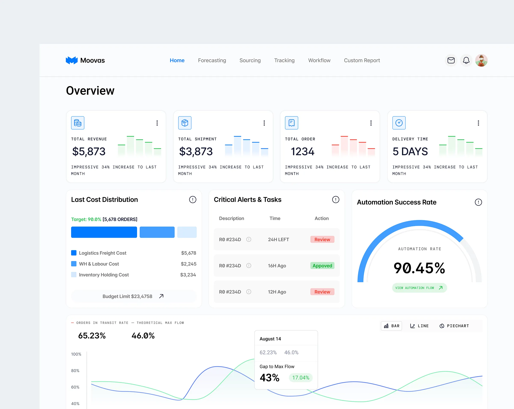

# Moovas Overview — form-js Schema

원본 디자인 시안: 사용자 첨부 이미지 (Moovas Overview Dashboard)
산출물: [`schemas/drafts/moovas-overview.form-js`](./moovas-overview.form-js)
스킬: [`form-designer`](../../.claude/skills/form-designer/SKILL.md)

## 레이아웃 매핑 (Carbon 16-col Grid)

| row | id | type | columns | height | 표현하는 영역 |
|-----|----|----|---------|--------|---------------|
| row-1 | card-1 | card | 16 | 64 | 상단 헤더 (Moovas 로고 + 네비게이션) — 자리표시 |
| row-2 | card-2 | card | 16 | 80 | 페이지 타이틀 "Overview" |
| row-3 | card-3 | card | 4 | 180 | KPI: Total Revenue |
| row-3 | card-4 | card | 4 | 180 | KPI: Total Shipment |
| row-3 | card-5 | card | 4 | 180 | KPI: Total Order |
| row-3 | card-6 | card | 4 | 180 | KPI: Delivery Time |
| row-4 | card-7 | card | 5 | 360 | Last Cost Distribution |
| row-4 | card-8 | card | 6 | 360 | Critical Alerts & Tasks |
| row-4 | card-9 | card | 5 | 360 | Automation Success Rate (게이지) |
| row-5 | card-10 | card | 16 | 400 | Orders in Transit Rate (차트) |

각 row의 `columns` 합 = 16 ✓ (`form-designer §5-6`).

## i18n 키 목록 (등록 필요)

다음 키는 본 스키마에서 처음 등장. `packages/designer-i18n/locales/ko.json`에 추가 등록 필요.

```
designer.moovas.nav.brand
designer.moovas.overview.title
designer.moovas.kpi.revenue.title
designer.moovas.kpi.shipment.title
designer.moovas.kpi.order.title
designer.moovas.kpi.deliveryTime.title
designer.moovas.cost.distribution.title
designer.moovas.alerts.title
designer.moovas.automation.title
designer.moovas.transit.chart.title
```

## 표현 가능 / 불가능 항목

**가능 (현재 등록 type만으로):**
- 12개 카드 그리드 골격 (4-up KPI / 3-split / full-width)
- 헤더 텍스트 + 높이 + 그림자(elevation) + 패딩

**불가능 (등록 type 부재 → 자리표시로 처리):**
- 상단 네비게이션 메뉴(`Home / Forecasting / ...`) — `tabs`로 대체 가능하지만 본 스키마에서는 자리표시 카드로 처리
- KPI 숫자값(`$5,873`), 변화율 텍스트, 미니 막대 차트
- 파이 막대(Last Cost Distribution), 진행률 게이지(Automation Rate)
- 알림 테이블 (Description / Time / Action 컬럼) — `table` 컴포넌트 미구현
- 라인 차트(Orders in Transit Rate)
- 우상단 아이콘 버튼(메일/벨/프로필) — `button` 컴포넌트 미구현

이 요소들은 추후 `chart`, `kpi-stat`, `table`, `gauge`, `button` 컴포넌트가 등록될 때 `card.components[]` 안으로 채워 넣어야 한다.

## 스키마 본체

```form-js
{
  "schemaVersion": 19,
  "type": "default",
  "components": [
    {
      "type": "card",
      "id": "card-1",
      "padding": "sm",
      "elevation": 0,
      "header": "designer.moovas.nav.brand",
      "headerTag": "h2",
      "layout": { "row": "row-1", "columns": 16, "height": 64 },
      "components": []
    },
    {
      "type": "card",
      "id": "card-2",
      "padding": "none",
      "elevation": 0,
      "header": "designer.moovas.overview.title",
      "headerTag": "h1",
      "layout": { "row": "row-2", "columns": 16, "height": 80 },
      "components": []
    },
    {
      "type": "card",
      "id": "card-3",
      "padding": "md",
      "elevation": 1,
      "header": "designer.moovas.kpi.revenue.title",
      "headerTag": "h4",
      "layout": { "row": "row-3", "columns": 4, "height": 180 },
      "components": []
    },
    {
      "type": "card",
      "id": "card-4",
      "padding": "md",
      "elevation": 1,
      "header": "designer.moovas.kpi.shipment.title",
      "headerTag": "h4",
      "layout": { "row": "row-3", "columns": 4, "height": 180 },
      "components": []
    },
    {
      "type": "card",
      "id": "card-5",
      "padding": "md",
      "elevation": 1,
      "header": "designer.moovas.kpi.order.title",
      "headerTag": "h4",
      "layout": { "row": "row-3", "columns": 4, "height": 180 },
      "components": []
    },
    {
      "type": "card",
      "id": "card-6",
      "padding": "md",
      "elevation": 1,
      "header": "designer.moovas.kpi.deliveryTime.title",
      "headerTag": "h4",
      "layout": { "row": "row-3", "columns": 4, "height": 180 },
      "components": []
    },
    {
      "type": "card",
      "id": "card-7",
      "padding": "md",
      "elevation": 1,
      "header": "designer.moovas.cost.distribution.title",
      "headerTag": "h3",
      "layout": { "row": "row-4", "columns": 5, "height": 360 },
      "components": []
    },
    {
      "type": "card",
      "id": "card-8",
      "padding": "md",
      "elevation": 1,
      "header": "designer.moovas.alerts.title",
      "headerTag": "h3",
      "layout": { "row": "row-4", "columns": 6, "height": 360 },
      "components": []
    },
    {
      "type": "card",
      "id": "card-9",
      "padding": "md",
      "elevation": 1,
      "header": "designer.moovas.automation.title",
      "headerTag": "h3",
      "layout": { "row": "row-4", "columns": 5, "height": 360 },
      "components": []
    },
    {
      "type": "card",
      "id": "card-10",
      "padding": "md",
      "elevation": 1,
      "header": "designer.moovas.transit.chart.title",
      "headerTag": "h3",
      "layout": { "row": "row-5", "columns": 16, "height": 400 },
      "components": []
    }
  ]
}
```

## 검증 결과

`designer-cli validate` 실측 결과:

```json
{ "ok": true, "errors": [] }
```

자기검증(§5) 8개 항목도 모두 통과:
- schemaVersion=19 ✓ / type 모두 등록(card) ✓ / 가시 문자열 designer.* ✓
- id 중복 없음 ✓ / 모든 row의 columns 합 ≤ 16 ✓ / `components: []` 모두 명시 ✓
- spec.json 외 prop 없음 ✓
